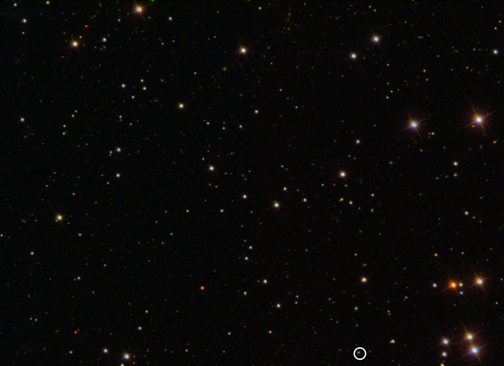
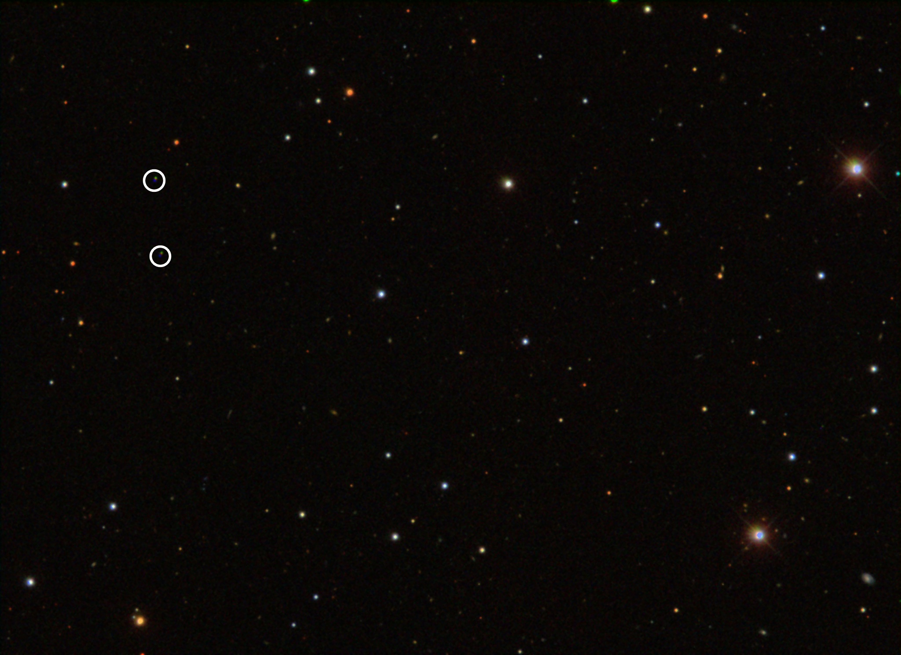
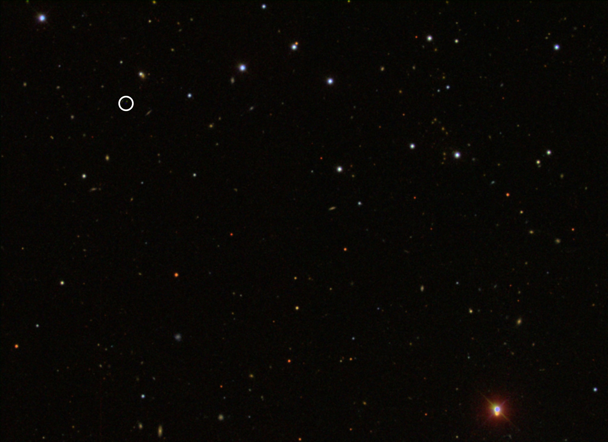

# sdss_asteroid_detect 
[](https://travis-ci.org/xquery/sdss_asteroid_detect)

IMPORTANT NOTE- this software is unstable and under development.

Small collection of utilities for detecting moving objects within [sdss](http://www.sdss.org/) images.

## Usage

The simplest approach is to grab a jpg image from SDSS and run naive_detect:

```
> naive_detect <jpg-image-file-name>
```

which will generate a candidate.jpg if it contains a potential moving object, marking its location
on the jpeg.

The moving object is identified by a circle in the following example image.



here is another example.



here is a good example of detection at the limit of image resolution.



## Overview

This effort is an attempt to detect moving objects (eg. asteroids) in SDSS images at scale.

* [SDSS - Sloan Digital Sky Survey](https://en.wikipedia.org/wiki/Sloan_Digital_Sky_Survey)
* [Sloan Digital Sky Survey](http://www.sdss.org/)
* [SDSS datasets](https://data.sdss.org/sas/dr13)
* [opencv](https://en.wikipedia.org/wiki/OpenCV)

The way [SDSS captures](http://cas.sdss.org/dr5/en/proj/basic/asteroids/findingasteroids1.asp) image data makes it straightforward to identify moving objects.

The general algorithm for detection I have developed is as follows:

* split image into RGB layers then subtract from each other
* stationary objects should negate themselves
* if there is anything remaining it will indicate offset aka movement
* convert to grayscale for circle detection using [HoughCircle](https://en.wikipedia.org/wiki/Hough_transform)
 
Because it is most familiar to me, I am currently working with jpeg imagas though will be switching over to using FITS soon. 
 
False positives are an issue:

* image flaring
* detecting poor image quality
* unknown (ex. picking up other kinds of artifacts/moving objects in SDSS image)

I have not quite got to 'the at scale' part as I am still grokking lots of ancillary SDSS data.
 
## Next steps
  
* Layer in ML approaches for better false positive detection 
* Genetic alg for identifying optimal artifact detection parameters
* Reconcile and report to [Moving Object Catelog](https://www.researchgate.net/publication/238534010_The_Sloan_Digital_Sky_Survey_Moving_Object_Catalog)


## Build and deploy

To build you may have to install some additional deps:
```
yum install epel-release
yum install cmake3
```

To build this set of utilities on linux, osx and windows platforms.

```
>cmake3 -DCMAKE_BUILD_TYPE=Debug -G "CodeBlocks - Unix Makefiles"
```

Note that running cmake will pull down dependencies.

Then run make, make install.

To create a release package
```
>cpack3 --config CPackConfig.cmake
```

### Dependencies
This project depends on the following external libs:

* [opencv](https://github.com/opencv/opencv): for image processing
* [rapidjson](https://github.com/miloyip/rapidjson): for json munging
* [loguru](https://github.com/emilk/loguru): for logging
* [gnuplot-cpp](https://github.com/orbitcowboy/gnuplot-cpp): for speaking to gnuplot
* [googletest](https://github.com/google/googletest): for testing
* [curl](https://curl.haxx.se): for http 

## License

[Apache License v2.0](LICENSE)
